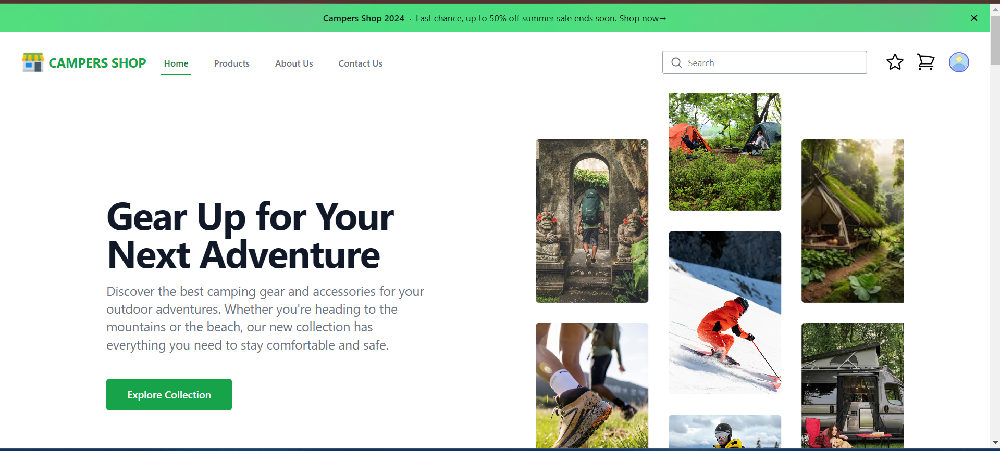
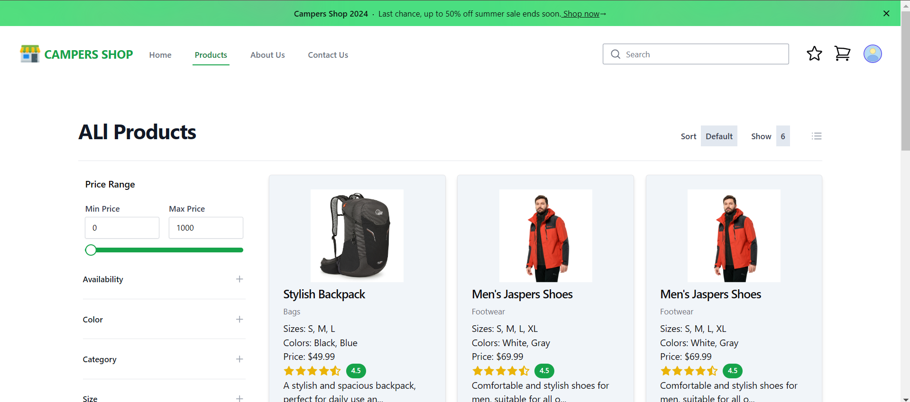
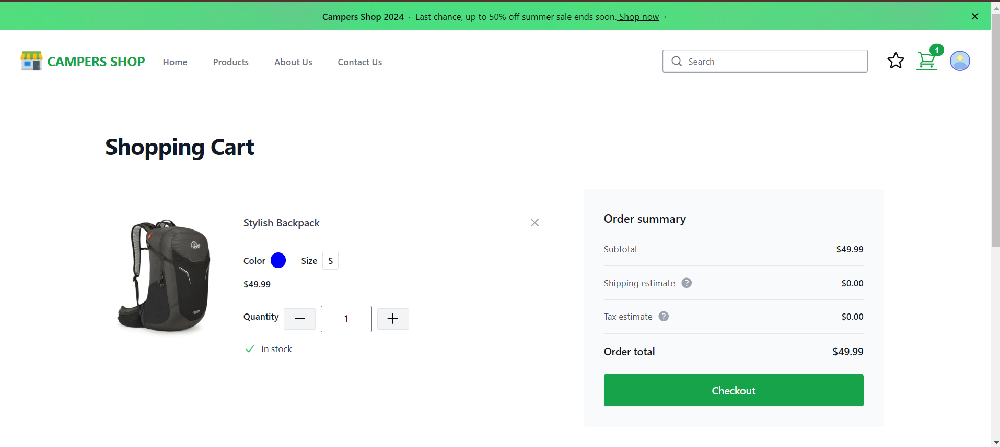
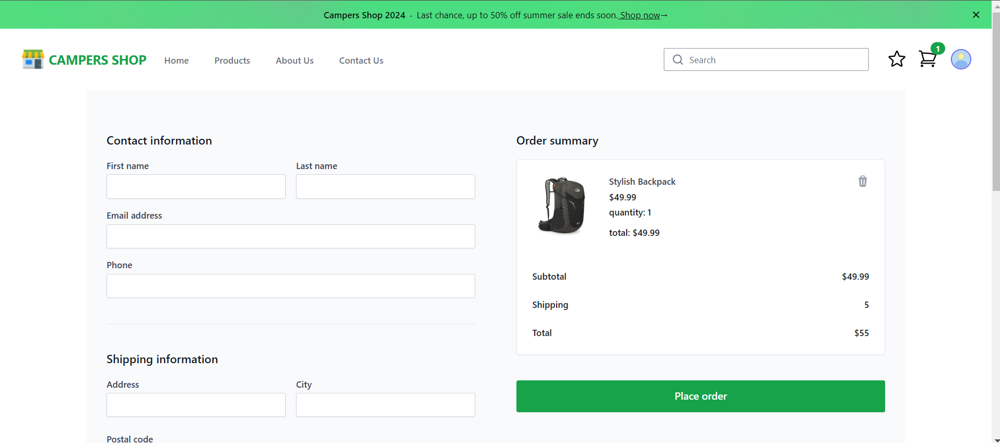
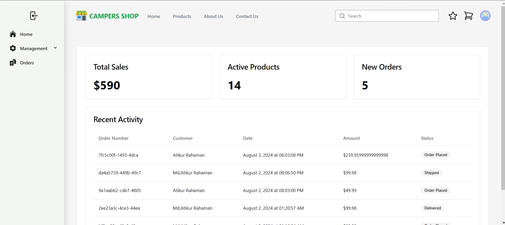
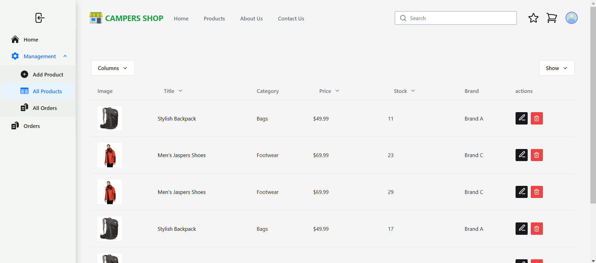
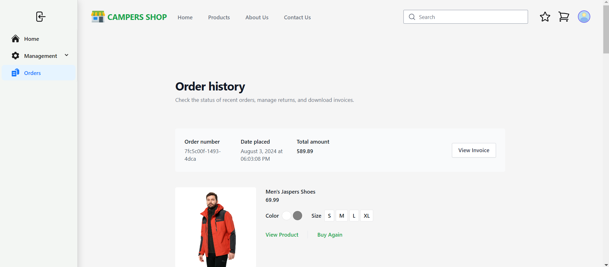

# Campers Shop

## Introduction

The Campers Shop Frontend is a React-based web application that serves as the user interface for the Campers Shop. It enables users to browse through a wide range of camping products, view product details, manage their shopping cart, and place orders. The application integrates with a backend server to fetch product data, handle user authentication, and process orders. The UI is built using modern React practices, including hooks and functional components, and styled with Tailwind CSS.

**_Live Link_**: [Campers Shop](https://campers-shop-frontend-lac.vercel.app/)

## Features

- **Product Listing**: Browse and search for camping products with pagination and sorting.
- **Product Details**: View detailed information about each product.
- **Shopping Cart**: Add products to the cart, update quantities, and remove items.
- **Order Management**: Place orders and view order history.
- **Responsive Design**: Mobile-friendly design for an optimal user experience on all devices.
- **Admin Dashboard**: Manage products, orders, and users through an admin interface.

## Technology Stack

- **React**: JavaScript library for building user interfaces.
- **Redux**: State management for managing application state.
- **React Router**: Library for routing in React applications.
- **Tailwind CSS**: Utility-first CSS framework for styling.
- **Cloudinary**: Cloud storage service for managing images.
- **React Hook Form**: Library for managing form state and validation.
- **React Pdf**: Library for generating order invoice

## Installation Guideline

Instructions on how to install, configure, and get the project running locally.

### Prerequisites

- Node.js and npm installed on your machine.
- Backend server running for API integration.
  - You can get it from [Car Rental System](https://github.com/Atik203/Campers-Shop-Backend)
- Cloudinary account for image storage.
- Strip: for payment system.

### Installation Steps

1. Clone the repository:
   ```bash
   git clone https://github.com/Atik293/campers-shop-frontend.git
   cd campers-shop-frontend
   ```
2. Install dependencies:

   ```bash
   yarn install

   ```

3. Create a `.env` file in the root directory and add the following environment variables:

   ```bash
   VITE_BASE_URL=http://localhost:5000
   VITE_COULDINARY_UPLOAD_PRESET=your_cloudinary_upload_preset
   VITE_COULDINARY_NAME=your_cloudinary_name
   VITE_STRIPE_SECRET=your_stripe_secret_key
   ```

4. Start the development server:

   ```bash
    yarn dev
   ```

5. Open [http://localhost:5713](http://localhost:5173) to view it in the browser.

## Screenshots

### Home Page



### Product Page



### Cart Page



### Order Page



### Dashboard Home Page



### Dashboard All Product List



### Order History



## License

This project is open source and available under the [MIT License](LICENSE).

## Contributors

Contributions are welcome! Please create a pull request or open an issue to discuss changes.
